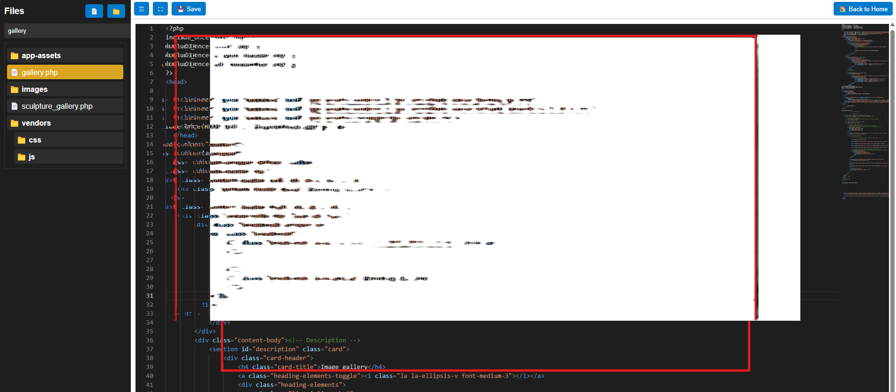

<h1 align="center">WebCode Editor</h1>

<p align="center">
  A lightweight and powerful in-browser code editor, made for developers to edit websites directly online.
</p>


## 📸 Preview 




## ✨ Features

- 📁 Interactive file/folder explorer
- 🧠 Monaco Editor with syntax highlighting
- 💾 Save changes directly to server
- ⛶ Fullscreen support
- 📂 Sidebar toggle
- 🔍 File search
- 🔐 Session-based access control
- ↩️ Return to site via Home button

---

## 🚀 Getting Started

Just add all files to your root directory, then update the access logic to fit your authentication.

```php
'session_start();
if (!isset($_SESSION['role']) || $_SESSION['role'] !== 'var') {
    http_response_code(403);
    exit("Access Denied.");
}'


🛠 Dependencies
Monaco Editor

You can load Monaco either:

Locally via vendor/

Or via CDN (Monaco Loader)

📌 Notes
Best run on HTTPS

Meant for internal or admin-only environments

PHP is required for backend file handling and access validation

👨‍💻 Author : Var Noromor
📫 Contact Me : https://github.com/orahv

📄 License
This project is licensed under the MIT License.
Feel free to fork, improve, and build your own!

💬 Feedback & Contributions
Have suggestions? Want to contribute?

📁 Fork this repo

🔧 Submit a PR

📥 Open an Issue

Let’s make web editing seamless for developers everywhere! 

© 2025 Var Noromor'
### 1. Clone the Repo

```bash
git clone https://github.com/orahv/webcode-editor.git